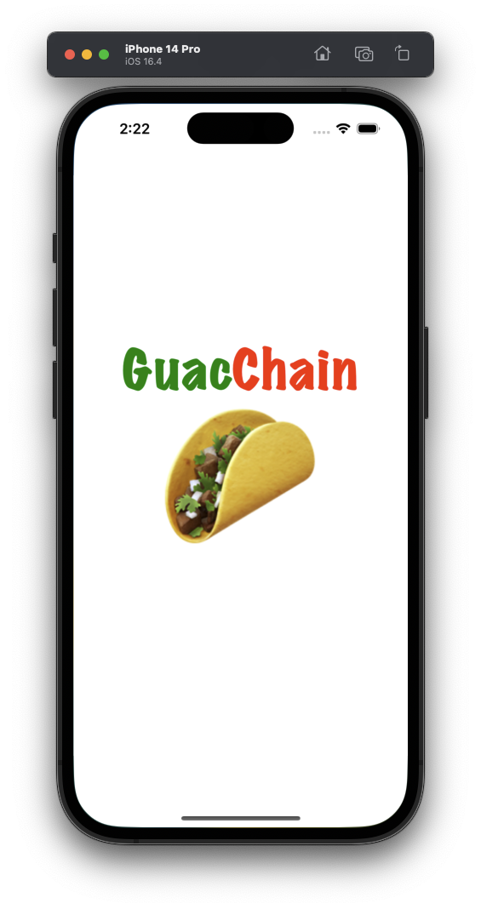
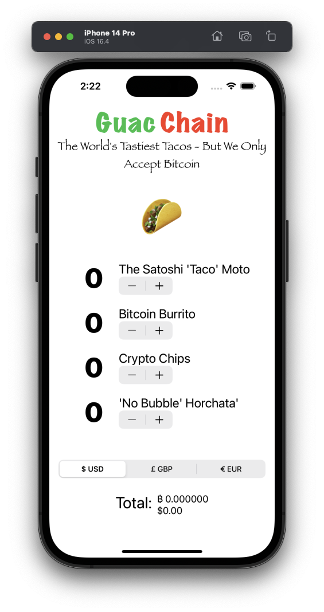

## GuacChain
The Final Exam for BCSwift had students show their knowledge of various layout and user interface techniques, State and Binding variables. Extracting views into separate files. Creating a ViewModel. Setting up an ObservableObject / StateObject. Making an API call using URLSession. Parsing JSON into Published variables. And much more. Students had 2.5 hrs to complete on their laptops. No access to prior code or looking up thing online. They could use a single sheet of double-sided notes they prepared on their own. The reason for this is to prep students for recall-level knowledge during code interviews. Want to try this out on your own? Simply pause before each question. Good luck! 

- Create an app for GuacChain restaurant.
- Build the App in MVVM.
- Parse the CoinBase API. 
- Convert the total price in 3 different currency and convert it in BTC.

## Screenshots

  
  
  

#### By John Gallaugher
https://bit.ly/prof-g-swiftui

